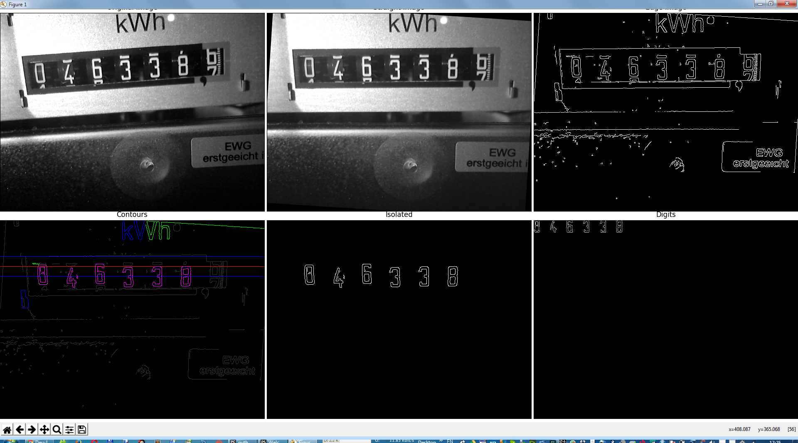

# energy-monitor
Energy Monitor based on Raspberry Pi with a web-cam.

# History and motivation
The project started with a simple question: *How much electricity does my house use?*

After some googling for commercial products and finding nothing acceptable I've noticed the project by Martin Kompf from Rüsselsheim (DE). See the [original article](https://www.mkompf.com/cplus/emeocv.html). He used a Raspberry Pi microcomputer with a web-cam to read the electricity counter value. He used OpenCV library to do the image adjustment, digit recognition and machine learning of OpenCV to recognize the meter readings. The data are stored in RRDtool database, which also handles some error checking.

I've purchased Raspberry Pi and a used web-cam, attached everything together and mounted it in front of my electricity meter.

My Logitech web-cam was setup with a far focus. I had to disassemble it and adjust the focus so that the distance between the camera and the meter is kept small.

Everything worked to the point until ML is supposed to recognize the learned digits. It did not work. Martin has used a grid of 10x10 size with the data from the original image. It looks like this:

See [issue on GitHub](https://github.com/skaringa/emeocv/issues/3).

After messing a little with C++ code it was clear the C++ is slow to work with. Compilation on Raspberry Pi after making a single line change is too slow and I have too little C++ experience to continue this way.

So I've decided to reprogram the whole thing in Python. Python because OpenCV has bindings to C++ and Python. Otherwise I'd probably do it in JS.

After a week of work it actually worked. Instead of using images from the camera I've used the digit contours to do the digit recognition. I've also increased the grid size to 30x15. The results are amazing. I've tested it with sklearn and got 95% recognition quality.

This is the end of the history. That is the current status of the project.

# Future plans

The original idea to see the consumption on the smart-phone is still not ready. I need to finish storing the data into a database. I am considering using a cloud database like [Firebase](https://firebase.google.com/) or [Crate.io](http://crate.io/). If I don't find any suitable cloud DB I'd use MySQL running on Rasberry Pi. I will loose the ability to check consumption when I'm not connected to home WiFi, but it's OK. Ideas are welcome.

While testing the image recognition and adjusting the camera I've made attempts to simplify the setup the process. In my imagination everything can be setup using a web-interface instead of command line commands. So there is a rudimentary PHP based web-interface which helps to setup everything. More work is needed here.

I connect to Raspberry Pi using VNC which is very slow when streaming video from web-cam over WiFi. I wanted to get lower latency video and used [this guide](https://pimylifeup.com/raspberry-pi-webcam-server/).

# In the mean time

In the mean time I've pitched this project at
[Startup Weekend Mittelhessen](https://www.startup-weekend-mittelhessen.de/). The project was one of the 15 projects selected for execution. In the end the team did not assemble and nothing emerged from it. This is my [pitch](docs/pitch.md).

During a PHP Conference 2017 I've heard a talk about Smart Home IoT by [Sebastian Golasch](https://github.com/asciidisco).

He suggested [Discovergy](https://discovergy.com/) which is a device that *replaces* your electricity meter with their device. They will collect the data directly from the electricity meter and provide the information on the smart-phone. Seems like the best option for people who do not want the tinker with DIY projects.

Alternatively you can purchase [Smappee](http://www.smappee.com/be_en/energy-monitor-home).

# Competitors

When preparing for the Startup Weekend I've researched other projects which aim to provide electricity monitoring.

* [AlertMe](https://en.wikipedia.org/wiki/AlertMe) was acquired by British Gas
* [Opower](https://en.wikipedia.org/wiki/Opower) was acquired by Oracle
	See their [TED talk](https://www.youtube.com/watch?v=8xHqRYw_M0s)
* [Kill a Watt](https://en.wikipedia.org/wiki/Kill_A_Watt)
	http://www.p3international.com/products/p4400.html
* [Google Power Meter](https://en.wikipedia.org/wiki/Google_PowerMeter) is cancelled. I've read it was too early.
* [Sense](https://sense.com/) is detecting appliances by sensors wrapped *around* the wires.
* [Efergy](https://engage.efergy.com/dashboard)
* [Neurio](https://www.postscapes.com/wifi-home-energy-monitor-neurio/)
* [Smart Me](http://www.smart-me.com/) - The smart-me Meter is the first Electricity Meter with a direct connection to Cloud. (200 EUR)
* [Discovergy](https://discovergy.com/) - Replace your meter with a digital meter for only 100 EUR.
* [Smappee](http://www.smappee.com/be_en/energy-monitor-home) - Simply connect Smappee to your fuse box with a clip-on sensor and let Smappee do the rest.

# General Information

* https://learn.openenergymonitor.org/electricity-monitoring/ac-power-theory/introduction
